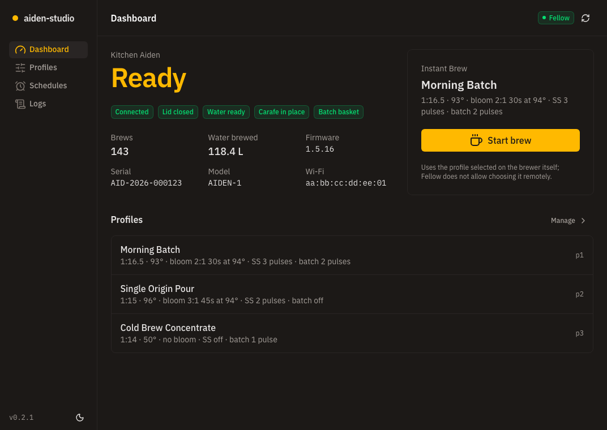
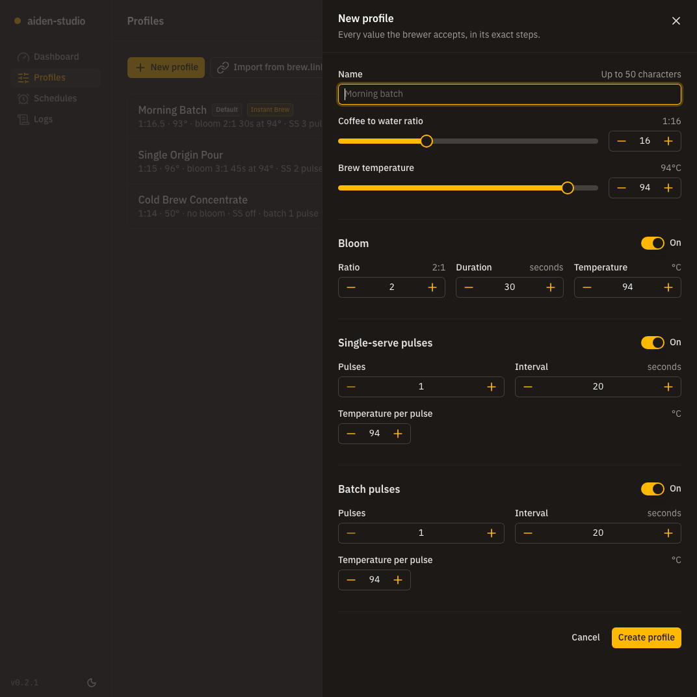
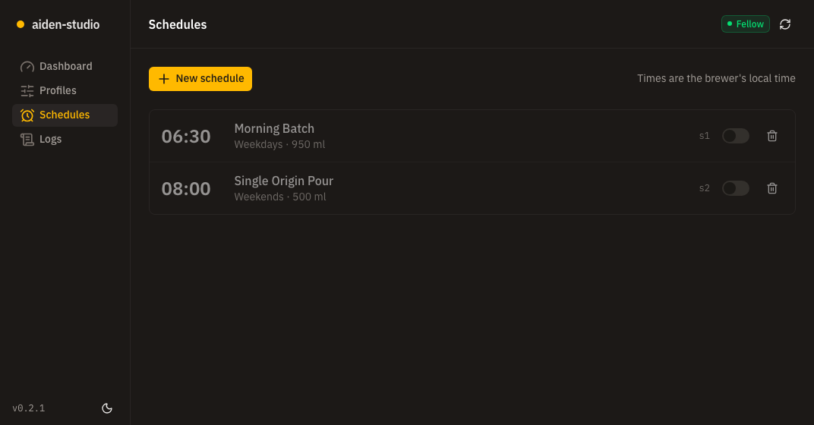
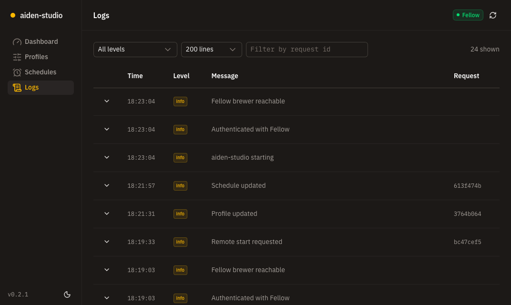
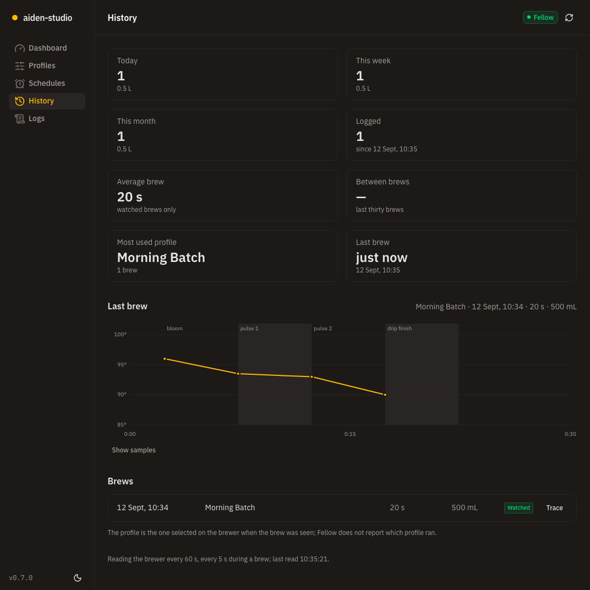

# aiden-studio

A personal web app for controlling a [Fellow Aiden](https://fellowproducts.com/products/aiden) coffee brewer:
brew profiles, schedules, brew.link import, share links, and remote Instant Brew, from a browser on your own machine.

> **Status:** Phase 1.5 complete. The app runs at login on your Mac under launchd, listens on loopback only, and
> is reachable from your own computers and phones over [Tailscale](https://tailscale.com). It is not a public
> website and is not built to become one. See `CHANGELOG.md`.

## How it works

Fellow publishes no API. This app talks to the same cloud endpoints the Fellow mobile app uses, with your
Fellow account credentials, from a small Node server that runs on your machine. The browser never talks to
Fellow and never sees those credentials.

- **Phase 1 — on the Mac.** The server listens on `127.0.0.1:5150` and nowhere else, with no login screen. The
  only credential anywhere is your Fellow login in `.env`.
- **Phase 1.5 — your own machines.** Tailscale joins your computers and phones into a private network of their
  own and publishes the dashboard onto it. The app still listens on loopback; Tailscale is the only door, and it
  opens for devices signed in to your Tailscale account and nothing else.

That shape is the point, not a stepping stone. Nothing is exposed to the internet and there is no public address.
Putting this on a public website would need a login inside the app first, which is not what it is for.

## The app

Dark by default (the toggle is in the sidebar footer), one accent, and every value the brewer accepts.

| Page | What it does |
|---|---|
| Dashboard | The brewer's state as one word (Ready, Brewing, Offline, Not ready) with every reported flag underneath, the reasons a brew cannot start, the **Start brew** button, which is enabled only when the brewer says it is ready and asks before it sends, and a sensor panel with everything the brewer reports, grouped for troubleshooting: the live phase, heater, pump, and water temperature; lid, tank, carafe, baskets, and shower head; brew and water totals; the settings on the brewer itself; and its identity; a descale banner with the Mark descaled button when descaling is due or close; brews and water today, this week, and this month; and the trace of the brew running now, or the last one. |
| Profiles | Every profile on the brewer with a one-line recipe summary. Create, edit, delete, share (a brew.link URL to copy), and import from a brew.link. The editor exposes every variable in its exact steps: ratio and temperature sliders in halves, bloom, and per-pulse temperatures that follow the pulse count. |
| Schedules | Each schedule with its time in the brewer's local time, days, water, and profile; pause or resume with the switch, delete, or add one with the day chips and time picker. |
| History | Brews and water by day, week, and month; average brew length and time between brews; the most used profile; every logged brew, with its trace on demand; the descale tally with its estimate and Mark descaled button, and when the brewer was descaled; and what the background reads are doing. |
| Logs | The production log file, newest first, filterable by level and by request id (click any id). Each row expands to the full record. |

Failed calls show a toast with the server's error code, never a blank failure. The `?new=1` query on the
profiles and schedules pages opens the create form directly.

| Dashboard | Profile editor |
|---|---|
|  |  |

| Schedules | Logs |
|---|---|
|  |  |
| History | |
|---|---|
|  | |

(Screenshots taken against the mock brewer. In development the log viewer explains that logs go to the terminal; the production build writes the file it reads.)

### Run against the mock brewer

You do not need a brewer, or even a Fellow account, to try the app:

```sh
pnpm mock:fellow                      # terminal 1: an in-memory Fellow API on http://127.0.0.1:3900
```

Then in `.env` set `FELLOW_BASE_URL=http://127.0.0.1:3900/v2` and any `FELLOW_EMAIL` / `FELLOW_PASSWORD`,
and run `pnpm dev` (or `pnpm build && pnpm start`). The mock has three profiles, two schedules, a ready
brewer, and accepts every mutation; `pnpm mock:fellow -- --flaky` makes every third read fail with a 503
so you can watch the retries. Leave `FELLOW_BASE_URL` blank to talk to the real Fellow API.

### The demo site

`pnpm build:demo` produces a static site with no server at all: a single-page build whose every `/api` call is
answered in the browser from sample data in `app/demo/`. It shows the whole app, with an invented brewer, seven
profiles, three weeks of brews and traces, a descale history, and logs. Nothing is connected to anything: no
Fellow account, no credentials, no real serial numbers, and a reload starts the sample world over.

```sh
pnpm build:demo
npx serve .output/public     # or: cd .output/public && python3 -m http.server 4173
```

It is not a stripped-down mock. The pages, the components and the brew statistics, descale tally, and phase
decoding are the same code the real app runs; only the data underneath is invented. Press **Start brew** in the
demo and the trace fills in over a hundred seconds, phase by phase, and the brew lands in the history.

**On Netlify.** `netlify.toml` in the repo root sets the build command, the publish directory, `AIDEN_DEMO=1`,
the single-page redirect, and the response headers; the Node version comes from `.nvmrc` and pnpm from the
`packageManager` field. Point Netlify at the repository and it needs no further configuration. From the CLI:

```sh
pnpm build:demo
npx netlify deploy --prod --dir=.output/public
```

A demo build never includes the server: `nuxt.config.ts` leaves `server/api`, `server/middleware`, and
`server/plugins` out of it entirely, so there is no Fellow client, no request pipeline, and nothing that wants
credentials. It builds on a machine that has no `.env` at all, which is what a hosting service has. The real
build is untouched: `AIDEN_DEMO` is what turns any of this on.

## Brew history and descale

The service keeps its own record of what the brewer does, because Fellow's API has no history and no maintenance
counters.

- **How it watches.** A fresh read of the brewer every 60 seconds while idle and every 5 seconds during a brew (the
  idle rate again once a brew has run for twenty minutes, for cold-brew steeps). Every fresh read the dashboard makes
  counts too, and a brew started from the app is re-read two seconds later. `HISTORY_ENABLED=false` in `.env` turns the
  background reads off; the log then only grows while a page is open.
- **What it logs.** One line per completed brew in `data/brews.jsonl`: start, end, duration, water, the profile
  selected on the brewer, whether the brew was watched or inferred, and the trace samples (phase, water temperature,
  heater, pump). Rules borrowed from the Home Assistant integration: a duration is trusted only when the brew was
  watched and the brew counter rose by exactly one; a counter that rose while nobody was watching (Mac asleep,
  service down) becomes an inferred brew with the brewer's own timestamps and no duration. Fellow never says which
  profile ran, so the log records the one that was selected on the brewer and the UI says so.
- **Time to go.** During a brew the live trace says about how long is left: measured from your previous watched
  brews of the same profile once there are any, and worked out from the recipe (bloom, an assumed pour rate, the
  pauses between pulses, a drip finish) until then. Fellow does not expose the brewer's own countdown.
- **Where it lives.** `data/` sits next to `logs/` in the working directory: the checkout for `pnpm start`, the
  installed copy under launchd. A reinstall keeps it; `uninstall.sh --purge` removes it. Nothing leaves this Mac.
- **Cleaning cycles.** The brewer announces a descale or rinse while it runs (and borrows the brew fields for it:
  1500 mL, a start time, `brewing: true`), so each cycle is logged to `data/cleanings.jsonl` with its start, end,
  duration, water, and how far the brew and water totals moved across it; a cycle never counts as a brew. The
  History page lists them, and the dashboard shows a banner while one runs and offers Mark descaled when one has
  just finished.
- **The descale tally.** Brews and litres since you pressed Mark descaled, a bar that turns amber at 80% and red at
  100% of `maintenance.descaleAfterLitres` (60 L to start; add `descaleAfterBrews` to count brews as well), and an
  estimate of the due date from the litres per day in the log, or since the last mark while the log is young. Until
  the first mark the tally counts from the brewer's lifetime totals. Marking writes only to `data/descale.json`.

## Quick start on a Mac

This is what the app was built for: one Mac that stays on, running it under launchd, with Tailscale letting
your other Macs and PCs open it. Tested on Apple Silicon (macOS 26, M-series); an Intel Mac is the
same apart from the Homebrew path noted below. Budget about fifteen minutes, most of it downloads. Every line
below goes into Terminal.

**1. Node 22 and pnpm.**

```sh
# Homebrew first, if you do not already have it
/bin/bash -c "$(curl -fsSL https://raw.githubusercontent.com/Homebrew/install/HEAD/install.sh)"

brew install node@22 pnpm
echo 'export PATH="/opt/homebrew/opt/node@22/bin:$PATH"' >> ~/.zshrc   # Intel Macs: /usr/local/opt/node@22/bin
exec zsh
node -v   # v22.x
pnpm -v   # 10.x
```

Already an nvm user? `nvm install 22 && nvm use 22`, then `corepack enable pnpm`. Node must be on the internal
disk: launchd will not start one that lives on an external volume.

**2. The app and your Fellow login.**

```sh
git clone https://github.com/cschweda/aiden-portal.git ~/aiden-portal
cd ~/aiden-portal
pnpm install
cp .env.sample .env
chmod 600 .env     # it is about to hold your real Fellow password
nano .env          # fill in FELLOW_EMAIL and FELLOW_PASSWORD: the login you use in the Fellow phone app
```

The repository is private, so the clone asks for a GitHub account that can read it.

**3. See it work, without touching the brewer.**

```sh
pnpm dev
```

Open `http://localhost:5150`. `fellow.dryRun` starts out `true`, so reads are live but every change is logged
instead of sent: the header shows a DRY RUN badge. Ctrl-C stops it.

**4. Run it for real, at login.**

```sh
# writes are real from here on; leave this line out to stay in dry run
printf 'FELLOW_DRY_RUN=false\n' >> .env

pnpm build
deploy/local/install.sh
open http://localhost:5150
deploy/local/status.sh      # loaded? running? answering?
```

The installer copies the build and `.env` into `~/Library/Application Support/aiden-studio` and registers a
launchd agent that starts at login and restarts on a crash. Run those last two commands again after any change
to the code, to `aiden.config.ts`, or to `.env`.

**5. Reach it from your other Macs and PCs.**

```sh
brew install --cask tailscale
open -a Tailscale        # sign in with the account every machine will use
```

In the Tailscale admin console, once: under **DNS** turn on HTTPS certificates, and under **Machines** open this
Mac's menu and disable key expiry, so it never quietly drops off after six months. Then publish the dashboard:

```sh
alias ts=/Applications/Tailscale.app/Contents/MacOS/Tailscale
ts serve --bg 5150
```

The first run prints a link to enable Serve for this machine; open it, approve, and run the command again. It
then prints the address, `https://<this-mac>.<your-tailnet>.ts.net`. Put that hostname into
`server.allowedHosts` in `aiden.config.ts`, and your Tailscale login (`ts status` shows it) into
`server.tailnetUsers` if you want to be the only one who can change anything, then rebuild:

```sh
pnpm build && deploy/local/install.sh
```

On every other machine, Mac or Windows: install Tailscale, sign in with the same account, open that `https://`
address. Nothing else to configure, and it works away from home too. The app itself never listens beyond
`127.0.0.1`; Tailscale is the only door.

Two files configure the app:

- **`.env`** (git-ignored, copied from the heavily commented `.env.sample`) holds the secrets: your Fellow
  email and password. It may also override a handful of settings for one run; leave those blank normally.
- **`aiden.config.ts`** (committed, at the repo root) is the single source of truth for everything else:
  bind address and port, dry run, cache and retry tuning, Fellow's API URL, logging, and UI defaults. Edit
  it and rebuild; it is compiled into each `pnpm dev` and `pnpm build`.

`fellow.dryRun` starts out `true`: every profile, schedule, and brew-start change is logged instead of sent to
Fellow, and the UI shows a DRY RUN badge. Reads still go through. Flip it once you trust the app.

`pnpm install` needs no build-script approvals. The few dependencies whose install scripts pnpm 10 skips are
listed, with reasons, in `pnpm-workspace.yaml`, as is the one dependency override.

## Run at home

Once `.env` holds your Fellow login and `aiden.config.ts` says what you want, install the app as a launchd
LaunchAgent. It starts when you log in, restarts if it crashes, and writes its own rotating log.

```sh
pnpm build
deploy/local/install.sh          # copies the build and .env into place, loads the service, waits for /api/health
open http://localhost:5150
deploy/local/logs.sh             # follows the app's log (JSON lines, secrets redacted)
deploy/local/status.sh           # loaded? pid? answering? last log lines
```

What the installer does: it copies `.output/` and `.env` to `~/Library/Application Support/aiden-studio`
and runs the service from there, not from this checkout. Two reasons: macOS does not let an unattended
process read a removable volume, so a checkout on an external SSD cannot be run by launchd directly; and a
rebuild or a git operation in the checkout should never touch a running service. The app's rotating log
lives next to that copy, in `~/Library/Application Support/aiden-studio/logs/current.log`; launchd's own
stdout for the job (the startup lines and any crash trace) goes to `~/Library/Logs/aiden-studio/launchd.log`.

What launchd does: starts the installed build at login with `node --env-file=.env`, restarts it after any
non-zero exit (a crash, or the startup guard refusing a bad configuration), and waits 30 seconds first if
the process died within 30 seconds of starting, so a misconfiguration cannot spin.

- **After editing `aiden.config.ts`:** `pnpm build && deploy/local/install.sh` (the file is compiled in).
- **After editing `.env`:** `deploy/local/install.sh` (it copies the file and restarts the service).
- **After pulling changes:** `pnpm install && pnpm build && deploy/local/install.sh`.
- **To stop it:** `deploy/local/uninstall.sh`; add `--purge` to remove the installed copy, its logs, and launchd's
  log directory too. The checkout is never touched.
- **If `node` is not on your login shell's PATH** (nvm, fnm): `AIDEN_NODE=/path/to/node deploy/local/install.sh`.
  Node itself should live on the internal disk for the same reason as the build.
- **After changing Node versions** (`nvm install`, `nvm uninstall`): `deploy/local/install.sh`. The service is
  pinned to the absolute path of the node it was installed with; when that binary is gone, launchd starts nothing
  and logs nothing. `deploy/local/status.sh` says so.
- **A friendlier address:** `http://aiden.localhost:5150` works with no setup at all; macOS resolves every
  `*.localhost` name to this machine instantly, and it is an allowed host. `aiden.local` is allowed too, but
  `.local` belongs to Bonjour on macOS: it needs both `127.0.0.1 aiden.local` and `::1 aiden.local` in
  `/etc/hosts` (with only the IPv4 line every lookup waits five seconds for Bonjour first). Either name
  reaches this Mac only. Browsers treat `localhost` names as secure, so the share dialog's copy button works
  there; on `aiden.local` it shows the link for you to copy by hand.
- **While it is installed, port 5150 is taken.** The installer refuses to run when something else is listening
  there (`pnpm dev`, `pnpm start`, the mock demo), so it can never mistake one of those for the service. Run the
  dev server elsewhere meanwhile: `PORT=3001 pnpm dev`.
- **If it will not start:** `deploy/local/status.sh` shows launchd's last exit code and the last log lines.
  A configuration problem (for example a non-loopback `HOST`, or missing Fellow credentials) is printed in
  `~/Library/Logs/aiden-studio/launchd.log` and retried every 30 seconds until you fix it and run the installer
  again.
- **If the installer says `launchctl bootstrap` failed:** open System Settings > General > Login Items &
  Extensions, make sure aiden-studio is switched on, and run the installer again.

launchd never rotates `launchd.log`. It gains two lines per start (a few hundred bytes every 30 seconds while a
bad configuration is being retried) and is safe to delete at any time.

The app listens on `127.0.0.1` only. Nothing else on your Wi-Fi reaches it directly, by design: there is no
login screen. Your own machines reach it through Tailscale, below.

### From your other computers, with Tailscale (Phase 1.5)

[Tailscale](https://tailscale.com) joins your computers into a private network that only they can see, at home or
anywhere else with internet. The Mac running the app publishes the dashboard onto that network with
`tailscale serve`, which forwards to the app on loopback, so the app itself never listens beyond that Mac. Every
device signed in to your Tailscale account can then open

```
https://<your-mac>.<your-tailnet>.ts.net
```

with a real certificate and no port. `tailscale serve` prints the exact address when you publish; use that full
name as it gives it. The short name and the IP addresses the Tailscale console also lists do connect, but the
certificate is issued for the full name only, so browsers warn on them.

**The Mac that runs it, once.**

1. One Tailscale account for every machine. Install Tailscale on that Mac and sign in. In the admin console at
   login.tailscale.com: under DNS turn on HTTPS certificates; under Machines, that Mac's menu, disable key expiry,
   so it never silently drops off the network after six months. The first `tailscale serve` also asks you to enable
   Serve for the node through a link it prints; do that once and run the command again.
2. Publish the dashboard: `tailscale serve --bg 5150` (on the App Store build the command is
   `/Applications/Tailscale.app/Contents/MacOS/Tailscale`). It persists across restarts; `tailscale serve status`
   shows it, and `tailscale serve --https=443 off` withdraws it.
3. The app side: put that Mac's `ts.net` name into `server.allowedHosts` in `aiden.config.ts`, and, if you want to
   be the only one who can change anything, your Tailscale login into `server.tailnetUsers` (`tailscale serve`
   stamps the signed-in login on every request; anyone else on the network can look but not change). After editing
   either, `pnpm build && deploy/local/install.sh`.

**Every other machine.** Install Tailscale, sign in with the same account, open the address. That is all.

- **Mac:** the Mac App Store, or the download at tailscale.com; sign in from the menu bar icon.
- **Windows:** the installer at tailscale.com; approve the one prompt about changing network settings; sign in from
  the system tray icon.
- **Phone:** the Tailscale app from the App Store or Play Store, same sign-in, same address in the browser.

**Away from home.** It works wherever the machine has internet: Tailscale connects the two devices directly across
the internet and falls back to its relays when a network blocks that, encrypted either way. The host Mac has to be
on, logged in, and running Tailscale, the same conditions the dashboard itself needs.

**If a machine cannot open it.** Check, in order: the Tailscale icon on that machine says connected; the host Mac
shows as connected in the admin console; `tailscale serve status` on the host Mac still lists the address;
`deploy/local/status.sh` on the host Mac says the app is running. With the Logs page set to Detailed, every request
shows the address it came in on and the Tailscale login it carried.

Never use `tailscale funnel`, which is the public version, and never change `server.host`: the app stays on
loopback and Tailscale is the only door.

### Without Tailscale: an SSH tunnel from a laptop on the same network

Without a login the app must stay on loopback, but a laptop can reach loopback on this Mac through an SSH
tunnel, which keeps the brewer behind your Mac's own login. Once, on this Mac: System Settings > General >
Sharing > Remote Login, on. Then on the laptop:

```sh
ssh -N -L 5150:127.0.0.1:5150 <your-account>@<your-mac>.local
```

Leave that running and open `http://localhost:5150` on the laptop. The name is the host Mac's Bonjour name, shown
under Sharing; use its IP address if the name does not resolve. Ctrl-C ends the tunnel. Tailscale, above, is the
better answer for phones and for being away from home; this tunnel is the fallback when Tailscale is not installed.

## Scripts

| Command | What it does |
|---|---|
| `pnpm dev` | Development server with hot reload |
| `pnpm build` | Production build into `.output/` |
| `pnpm start` | Run the production build (reads `.env` via `node --env-file`) |
| `pnpm test` | Full test suite |
| `pnpm lint` | ESLint, then `scripts/check-shell.sh` (bash syntax, shellcheck when installed, a render of the launchd template) |
| `pnpm typecheck` | `nuxt typecheck` plus the test tree |
| `scripts/smoke.sh` | Probes a production build for the things Vitest cannot see: guard, headers, Host/CSRF, error shapes, log file |
| `deploy/local/install.sh`, `status.sh`, `logs.sh`, `uninstall.sh` | The launchd service (see Run at home) |

## Configuration

`aiden.config.ts` documents every setting inline. The environment only adds secrets and, optionally, a
single-run override of the keys below; `.env.sample` documents each one.

| Variable | Purpose |
|---|---|
| `FELLOW_EMAIL`, `FELLOW_PASSWORD` | Required. Your Fellow app login. Server-side only, never logged. |
| `FELLOW_DRY_RUN` | Overrides `fellow.dryRun`. |
| `FELLOW_TIMEZONE` | Overrides `fellow.timezone` (IANA zone sent to Fellow at login). |
| `HOST`, `PORT` | Override `server.host` / `server.port`. `NITRO_HOST` / `NITRO_PORT` are honoured too, with the same guard. |
| `ALLOWED_HOSTS` | Overrides `server.allowedHosts` (hostnames only, as they appear in the `Host` header). |
| `TAILNET_USERS` | Overrides `server.tailnetUsers` (comma-separated Tailscale logins allowed to make changes). |
| `LOG_LEVEL` | Overrides `logging.level`. |
| `HISTORY_ENABLED` | `false` stops the background reads that feed the brew log, the trace, and the descale tally. |
| `HISTORY_DIRECTORY` | Overrides `history.directory` (where `brews.jsonl` and `descale.json` are written). |

## API

Every route lives under `/api` and answers JSON. Mutations are POST, PATCH, or DELETE and must come from
this site: the browser proves it with `Sec-Fetch-Site: same-origin`; a script or `curl` must send
`Origin: http://localhost:5150` instead, or it gets a 403.

| Route | Purpose |
|---|---|
| `GET /api/health` | liveness, no Fellow call |
| `GET /api/status` | `{ dryRun, version, fellow }` where `fellow` is the last Fellow outcome |
| `GET /api/device?fresh=1` | device state plus `canStartBrew` and the list of `blockers` |
| `GET /api/profiles?fresh=1`, `POST /api/profiles` | list, create |
| `PATCH /api/profiles/:id`, `DELETE /api/profiles/:id` | update (send the full profile), delete |
| `POST /api/profiles/:id/share` | `{ link }` |
| `POST /api/profiles/import` | body `{ link }`; imports a brew.link profile |
| `GET /api/schedules?fresh=1`, `POST /api/schedules` | list, create |
| `PATCH /api/schedules/:id`, `DELETE /api/schedules/:id` | update (for example `{ "enabled": false }`), delete |
| `POST /api/brew/start` | starts the configured Instant Brew, or 409 with the reasons it cannot |
| `PATCH /api/logs/level` | body `{ level }`; switches the log level until the service restarts |
| `GET /api/history` | stats, the descale tally, the brew running now with its samples, the last traced brew, recent brews, the poller's state |
| `GET /api/history/brews/:id` | one logged brew with its trace samples |
| `POST /api/descale` | records that the brewer was descaled now; the tally restarts from its current totals |

Errors are `{ error, message?, issues? }`: 400 for validation, 502 for a Fellow failure (the code only,
never Fellow's response), 500 otherwise. Reads are cached for 30 seconds; `?fresh=1` bypasses the cache.

## Logs

In development everything goes to the terminal. In production pino writes JSON lines to
`logs/aiden.<date>.<n>.log` (an owner-only directory under the working directory: the checkout for `pnpm start`,
the installed copy under launchd), rotates daily or at 50 MB, keeps 14 files, and points `logs/current.log` at
the active one, so `tail -F logs/current.log` keeps following across rotations. Passwords, tokens, and
cookies are redacted before they are written. Every request carries an `x-request-id` header that matches
its log lines. The Logs page's Detail control switches the level being written (quiet, normal, detailed,
everything) until the service restarts; the persistent default is `logging.level` in `aiden.config.ts` or
`LOG_LEVEL` in `.env`. Stdout gets exactly two lines at startup: ours (address, dry run, log path) and Nitro's own
`Listening on …`; under launchd that is all its stdout file should ever hold, besides crash traces.

## Red team / blue team log

Newest entry first, open. Older entries are collapsed. Each entry records what was attacked (red), what was
found, and what now defends against it (blue). Add a new dated `###` entry at the top and move the previous
one into the `<details>` block at the bottom.

### 2026-09-12 — Second pass, when the app left the Mac (Phase 1.5)

**Context.** Until now the only way to reach the app was to sit at the Mac, and the first pass said plainly that a
proxy in front of it would bypass that. Tailscale is now exactly such a proxy: `tailscale serve` accepts the
connection and speaks to the app from 127.0.0.1, so it looks like the owner. The question for this pass is what
replaces "you are sitting at the Mac" as the thing being trusted.

**Red — what was tried**

- **Reach the app from the house network.** Port 443 answers on the Tailscale address (100.94.68.74) and is
  closed on the Wi-Fi address and on loopback. Port 5150 is still bound to 127.0.0.1 alone.
- **Find the address from outside.** The `ts.net` name does not resolve on public DNS; it exists only inside the
  tailnet's own resolver. `tailscale funnel`, which would publish it, is never used and is documented as forbidden.
- **Answer to a borrowed hostname.** The Host allowlist names the `ts.net` host explicitly; every other value is
  still a 400, so a DNS record someone else points at the machine gets nothing.
- **Act as the owner from another tailnet device.** `tailscale serve` stamps `Tailscale-User-Login` on every
  request it forwards. Changes from a login that is not in `server.tailnetUsers` are refused with 403
  (`tailnet_user_not_allowed`); reads are left alone.
- **Forge that header from a browser on the Mac.** Browsers cannot set it, and every mutation still has to prove
  same-origin or carry an allowed Origin, so the same-site rule remains the gate it was.

**Blue — what defends it now**

- **The bind address is unchanged.** The app binds 127.0.0.1 and the startup guard still refuses anything else.
  Tailscale carries traffic between machines; the app never listens beyond this one.
- **The tailnet is the authentication.** Joining it means signing in to the owner's Tailscale account.
  `server.tailnetUsers` narrows that further: a device on the tailnet that is not the owner's login may look at
  the brewer but not change it.
- **Every request is attributable.** The Tailscale login and the host it arrived on are logged with each request,
  and the Logs page's Detail control shows them without a restart.
- **TLS is real off-machine.** Let's Encrypt issues the certificate for the machine's `ts.net` name, so the
  plain-http compromises that loopback allowed do not travel with it.

**Accepted for now.** Any signed-in device of the owner's is trusted to read, so an unlocked device that is
already on the tailnet can see the brewer. A login inside the app is the answer to that, and is only worth
building if this ever has to be reachable by someone who is not the owner.

<details>
<summary>Older entries</summary>

### 2026-09-10 — First pass, after checkpoint 2

**Context.** Phase 1 runs with no login on a loopback-only server, so the threat model is "anything that can
reach 127.0.0.1 on this Mac": every browser tab the owner opens, every other local process, and DNS-rebinding
or cross-site tricks from pages the owner visits. There is nothing to authenticate, so the defenses are
about which requests the server is willing to act on and what it is willing to say back.

**Red — what was tried** (by hand with curl against a production build, plus an independent code review that
repeated and extended the probes, then folded into `scripts/smoke.sh` so it runs on every build):

- Bind-address escapes: `HOST=0.0.0.0`, `NITRO_HOST=0.0.0.0` with a loopback `HOST`, missing credentials.
- Host header games: foreign hosts, `LOCALHOST`, trailing dot, `127.0.0.1.evil`, empty and missing Host,
  `X-Forwarded-Host`.
- Cross-site requests: bare POST, `Origin: null`, lookalike origins (`localhost.evil.example`,
  `localhost@evil.example`), `Sec-Fetch-Site: same-site` with a foreign Origin, cross-site GET to `?fresh=1`,
  HEAD and OPTIONS on mutation routes, `X-HTTP-Method-Override`.
- Bodies: malformed JSON on POST and PATCH, arrays, `__proto__` keys, 3 MB POST, 2 MB PATCH, titles with
  `<` and the allowed specials.
- Paths: traversal in profile and schedule ids (`../start?confirm=true`), unknown API paths, wrong methods.
- Leakage: whether any error, header, or log line carries the Fellow password, tokens, or Fellow's raw
  response bodies; what `/api/status` reveals; what stdout and the log file contain.
- Dependencies: `pnpm audit`.

**Found and fixed**

| Severity | Finding | Fix |
|---|---|---|
| High | `NITRO_HOST=0.0.0.0` passed the guard (which read only `HOST`) and bound every interface. | Config mirrors Nitro's precedence and the startup plugin pins `NITRO_HOST`/`NITRO_PORT` to the validated value, so the file, the guard, and the socket cannot disagree. |
| Medium | A cross-site page could make this server call Fellow through GET requests such as ``; CORS hides the answer but does not stop the call. | Any `/api` request a browser labels `cross-site` or `same-site` is refused (403), GET included. |
| Low | Malformed JSON and `__proto__` bodies escaped the shared error mapping (a 500 with a logged stack on PATCH, h3's own envelope on POST). | h3 client errors stay in our envelope with their status; h3 server errors never forward details. |
| Low | nuxt-security's XSS validator produced a second, uncoded 400 shape and inspected query strings. | Disabled; Zod strict schemas already validate every field of this JSON API. CSP stays on. |
| Low | Unknown `/api` paths and wrong methods answered 200 with the HTML app shell. | `server/api/[...].ts` answers a JSON 404. |
| Low | PATCH bodies had no size cap (nuxt-security's limiter skips PATCH). | 1 MB cap on every mutation before any route buffers the body. |
| Low | A missing Host header passed the allowlist (h3 substitutes `localhost`). | The header is read directly and fails closed. |
| Low | API responses carried no `Cache-Control`. | `no-store` on every `/api` response. |
| Low | `logs/` was created with default permissions; a world-readable `.env` went unnoticed. | `logs/` is created `0700`; startup warns when `.env` is readable by other accounts. |
| Low | esbuild 0.27.7 via `@nuxt/fonts` carried GHSA-g7r4-m6w7-qqqr (dev-server file read, Windows only). | Overridden to the patched line in `pnpm-workspace.yaml`; audit is clean. |
| Info | `X-Frame-Options: SAMEORIGIN` disagreed with CSP `frame-ancestors 'none'`. | `DENY`. |
| Info | A remote-start check on a cold client judged readiness on the device list, whose fields are not live. | A fresh device read always goes on to the live detail route. |
| Medium (regression, same day) | The first version of the same-site rule broke the app's own server render: Nuxt forwards the page navigation's `Sec-Fetch-*` headers into its server-side API calls, and Chrome labels a navigation from a link on another site as cross-site, so the dashboard failed for anyone arriving via a link. A first fix exempted top-level navigations, which reopened a path for a page elsewhere to send the owner's tab to an API URL or prefetch it. Found in the browser click-through and by the checkpoint review. | The strict rule stands (any cross-site or same-site request to `/api` is refused, whatever its mode) and speculative loads (`Sec-Purpose: prefetch`/`prerender`) are refused too. The app's own API reads are client-only, so the server never forwards a navigation's headers into requests to itself. Covered by tests and the smoke script. |
| Low | A failed refresh could blank the dashboard, and a read failure on the profile or schedule pages rendered as "No profiles yet". Found by the checkpoint review. | Reads keep the last good data on a failed refresh, mark it stale, and show the server's reason; every page has an explicit error state. |
| Info | The Fellow client followed HTTP redirects, which would re-send the login body wherever a redirect pointed. | `redirect: 'error'` on every Fellow request. A plain-http `FELLOW_BASE_URL` is announced on startup so a forgotten mock setting cannot pass for the real brewer. |

**Blue — defenses now in place**

- **Loopback only, enforced twice.** The server refuses to start unless the effective bind address is
  loopback, and it sets that address itself from `aiden.config.ts`. The guard sees the bind address only:
  a proxy in front of it would bypass the whole model, which is why nothing may be put in front of the app
  unless it carries an identity check of its own.
- **Which requests are acted on.** Host allowlist (400) closes DNS rebinding; the same-site rule (403)
  keeps other sites from driving the API at all; mutations must prove same-origin or carry an allowed
  Origin; bodies are capped; ids are validated before they touch a URL; every field of every body is
  validated by strict schemas that reject unknown keys.
- **What is said back.** One error envelope: 400 with issue paths, 502 with a Fellow error *code* and our
  own message, 500 with nothing. Fellow's response bodies never reach the browser. API responses are
  `no-store`. Headers from nuxt-security: CSP with `frame-ancestors 'none'`, `X-Frame-Options: DENY`,
  `nosniff`, `Referrer-Policy: no-referrer`, COOP/CORP `same-origin`, a restrictive Permissions-Policy.
- **What is written down.** Logs redact passwords, tokens, and cookies at three depths; the log directory
  is owner-only; secrets live only in `.env`, which the app checks for permissive permissions at startup.
- **What is sent to Fellow.** Only GET and DELETE are retried, so a flaky 503 can never create a duplicate
  profile; reads are cached and de-duplicated so the dashboard cannot hammer an unofficial API; dry run is
  the default until the owner turns it off.
- **Verification.** 340 Vitest cases cover the client and the request pipeline in-process;
  `scripts/smoke.sh` re-runs the probes above against every production build.

**Accepted for now.** No TLS on loopback (nothing to protect from); the two stdout lines; the dev server's
HMR and devtools endpoints, which bind to the same loopback address.

</details>

## Project layout

- `server/lib/fellow/` — the Fellow client. Pure TypeScript, no Nuxt imports, so it can become its own package.
- `aiden.config.ts` — every non-secret setting; `server/utils/config.ts` merges it with `.env` and is the only place `process.env` is read.
- `server/api/` — thin Nuxt server routes over the client; `server/middleware/` is the request pipeline.
- `app/` — the Nuxt UI front end: `pages/`, `components/`, `composables/`, and `utils/` (pure, unit-tested logic such as the profile form rules and time conversion).
- `tests/` — Vitest, with msw standing in for Fellow.
- `scripts/mock-fellow.mjs` — an in-memory Fellow API for development and demos.
- `deploy/local/` — the launchd LaunchAgent template and its install, status, logs, and uninstall scripts.

See `ARCHITECTURE.md` for the layer split and the list of API behaviors that are inferred rather than verified.

## Hat tip: fellow-aiden

This project stands on the shoulders of [fellow-aiden](https://github.com/9b/fellow-aiden) by
[9b](https://github.com/9b), the Python library that first worked out how to talk to the Aiden, and of the
[Fellow Aiden Home Assistant integration](https://github.com/kristofferR/FellowAiden-HomeAssistant), whose
maintained client documents the v2 API: the refresh-token flow, the `overallTemperature` profile field,
brew.link drop types, remote Instant Brew, and the device state that gates it. Fellow documents none of this.
Everything aiden-studio knows about the endpoints, the required headers, the profile and schedule validation
rules, and the server-side fields was learned from those two projects. aiden-studio is an independent
TypeScript implementation that ports the behavior rather than the code, but if it is useful to you, the credit
belongs upstream. Both projects are licensed under GPL-3.0.

## License

MIT. See `LICENSE`.
